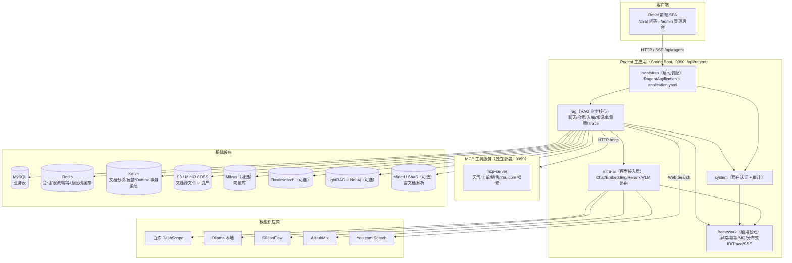
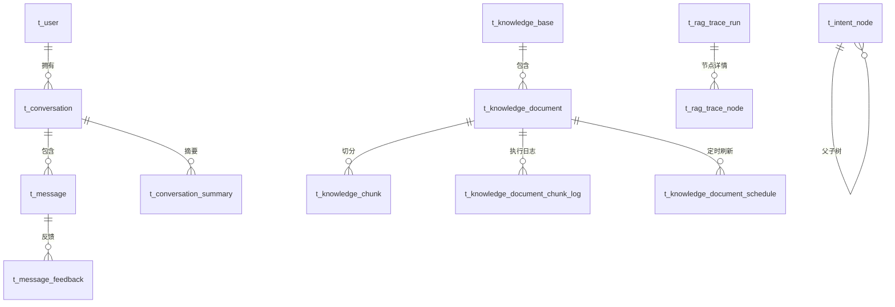
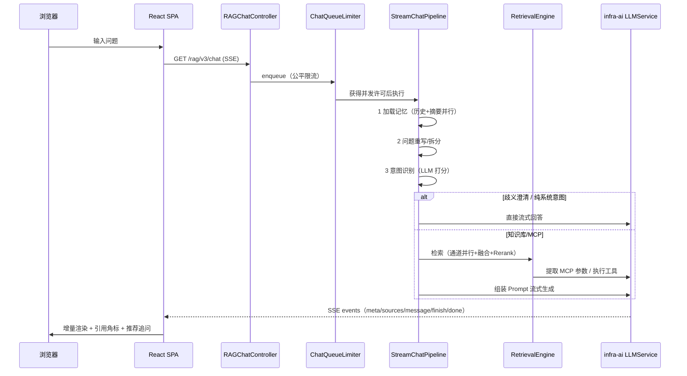

# 01 总体架构设计

## 1. 项目定位

Ragent AI 是一个面向 **Agentic RAG** 演进的**生产级 Java AI 应用平台**，覆盖
"文档入库 → 混合检索 → 智能问答"的完整链路。它解决的问题包括：

- 混合检索：向量、关键词、知识图谱、联网搜索并行召回，支持去重、RRF 融合与 Rerank；
- 问题理解：查询词映射、问题重写与拆分、树形意图识别、多知识库路由；
- 模型与工具：模型档位、首包探测、熔断降级，MCP 工具发现、提参与校验；
- 会话记忆：最近 N 轮消息 + 持久化摘要，控制 Token 成本；
- 流量保护：Redis 公平队列与分布式并发控制；
- 知识闭环：可编排入库 Pipeline、远程刷新、回答溯源、用户反馈、Trace 与管理后台。

## 2. 技术栈总览

### 后端

| 类别 | 选型 |
|:---|:---|
| 语言 / JDK | Java 21 |
| 框架 | Spring Boot 4.1.0（webmvc、data-redis、validation、jdbc）、MyBatis-Plus 3.5.17 |
| 认证 | Sa-Token 1.45.0（redis-template） |
| 消息队列 | Kafka（spring-kafka 4.1.0 / kafka-clients 4.2.1；事务消息采用 Outbox 模式） |
| 缓存 / 分布式组件 | Redisson 4.6.1、Redis、TransmittableThreadLocal 2.14.5 |
| 业务库 | MySQL 8.0.46（utf8mb4，JSON 列） |
| 向量库 | Milvus 3.0.0（milvus-sdk-java 3.0.6，`rag.vector.type=milvus`） |
| 关键词检索 | Elasticsearch（可选，`rag.keyword.type=es`） |
| 知识图谱 | LightRAG 后端（可选，`rag.graph.type=lightrag`） |
| 对象存储 | S3 兼容（RustFS/MinIO，AWS SDK 2.40.2）或阿里云 OSS（3.18.5） |
| 文档解析 | Apache Tika 3.2.3、commonmark 0.22.0、Batik 1.18、MinerU SaaS |
| MCP | MCP Java SDK 1.1.2（`mcp` + `mcp-json-jackson2`） |
| Agent 引擎 | AgentScope 2.0.2（依赖已引入 agent 模块，代码尚未落地） |
| 审计 | bizlog-sdk 3.0.6（mzt-log） |
| 工具库 | Hutool 5.8.37、Guava、Gson、OkHttp 5.3.2 |
| 构建 | Maven（spotless 代码格式、surefire + Mockito agent） |

> 注：Boot 4 默认 Jackson 3，而 MCP SDK 仍用 Jackson 2，根 pom 引入了
> `spring-boot-jackson2` 兼容模块。

### 前端

| 类别 | 选型 |
|:---|:---|
| 框架 | React 18.3 + TypeScript 5.5 |
| 构建 | Vite 5.4（dev 代理 `/api → localhost:9090`） |
| 路由 | react-router-dom 6.26 |
| 状态 | Zustand 4.5（authStore / chatStore / themeStore） |
| UI | Tailwind CSS 3.4 + Radix UI（shadcn 风格组件）+ lucide-react + sonner |
| 表格 / 图表 | TanStack Table、Recharts |
| 图谱可视化 | AntV G6 5.x（知识图谱页） |
| 文档预览 | pdfjs-dist、docx-preview、@js-preview/excel |
| 表单 | react-hook-form + zod |
| Markdown | react-markdown + remark-gfm + rehype-raw/sanitize + remark-cjk-friendly |
| 流式 | fetch + ReadableStream 手写 SSE 解析（含指数退避重试） |

## 3. 总体架构

## 4. 分层设计思想

项目按"职责 + 变化方向"分层，刻意把**业务编排、AI 供应商差异、通用基础设施**
隔离开，使切换模型、向量库或对象存储时核心问答流程不需要跟着重写：

| 层 | 模块 | 变化方向 |
|:---|:---|:---|
| 启动装配层 | `bootstrap` | 只有启动类与配置，业务代码禁止进入 |
| 业务核心层 | `rag` | 问答编排、检索、入库、知识库管理、意图、Trace、管理端 API |
| 系统支撑层 | `system` | 用户认证（Sa-Token）与业务审计（bizlog），位于各业务引擎之下 |
| 模型接入层 | `infra-ai` | 屏蔽不同模型供应商协议差异，提供统一能力接口 + 路由降级 |
| 通用基础层 | `framework` | 响应体/异常、幂等、分布式 ID、MQ 适配、TTL 上下文、SSE、跨节点取消、Trace 支撑 |
| Agent 执行层 | `agent` | v2 ReAct 执行架构（预留，消费 rag 的检索门户） |
| 工具边车 | `mcp-server` | 独立 MCP 工具服务，通过标准 MCP 协议被 rag 调用 |

## 5. 进程 / 部署形态

1. **主应用**：`bootstrap` 打包为可执行 jar（spring-boot-maven-plugin repackage），
   端口 9090，context-path `/api/ragent`。
2. **MCP Server**：`mcp-server` 独立打包运行，端口默认 9099（由主应用
   `rag.mcp.servers[].url` 配置），通过 `POST /mcp`（Streamable HTTP Transport）
   暴露工具。
3. **基础设施**：MySQL、Redis、Kafka、MinIO、Milvus 为必选；Elasticsearch /
   LightRAG / MinerU / 对象存储按配置开关启用。
4. **前端**：Vite dev server（5173）代理 `/api` 到 9090；生产构建为静态资源，
   由网关或 Web 服务器转发到同一 context-path。

## 6. 数据模型概览（24 张表）

### 表清单与职责

| 域 | 表 | 职责 |
|:---|:---|:---|
| 用户 | `t_user` | 用户、角色（admin/user）、密码、头像 |
| 会话 | `t_conversation` / `t_message` / `t_conversation_summary` | 会话、消息（含 sources/thinking/recommended_questions）、摘要 |
| 反馈 | `t_message_feedback` | 回答点赞/点踩（MQ 异步落库） |
| 知识库 | `t_knowledge_base` / `t_knowledge_document` / `t_knowledge_chunk` | 知识库、文档（状态机）、分块 |
| 入库 | `t_knowledge_document_chunk_log` | 每次分块执行的 Parse/Chunk/Embed/Persist 日志 |
| 调度 | `t_knowledge_document_schedule` / `..._schedule_exec` | 远程文档定时刷新（cron + 分布式锁） |
| 意图 | `t_intent_node` | 树形意图节点（KB/MCP/SYSTEM 类型、多 collection、prompt） |
| 路由 | `t_query_term_mapping` | 查询词映射（同义词归一化） |
| Trace | `t_rag_trace_run` / `t_rag_trace_node` | 每次问答的调用链与节点耗时/输入输出 |
| Agent | `t_agent_profile` / `t_agent_prompt` | Prompt 运行时管理（Profile + Slot） |
| 入库流水线 | `t_ingestion_pipeline` / `t_ingestion_pipeline_node` / `t_ingestion_task` / `t_ingestion_task_node` | 用户可编排的入库节点链与任务执行 |
| 示例 | `t_sample_question` | 首页示例问题 |
| 审计 | `t_biz_change_log` | 业务变更前后快照与字段差异 |

## 7. 一次问答的端到端视图

