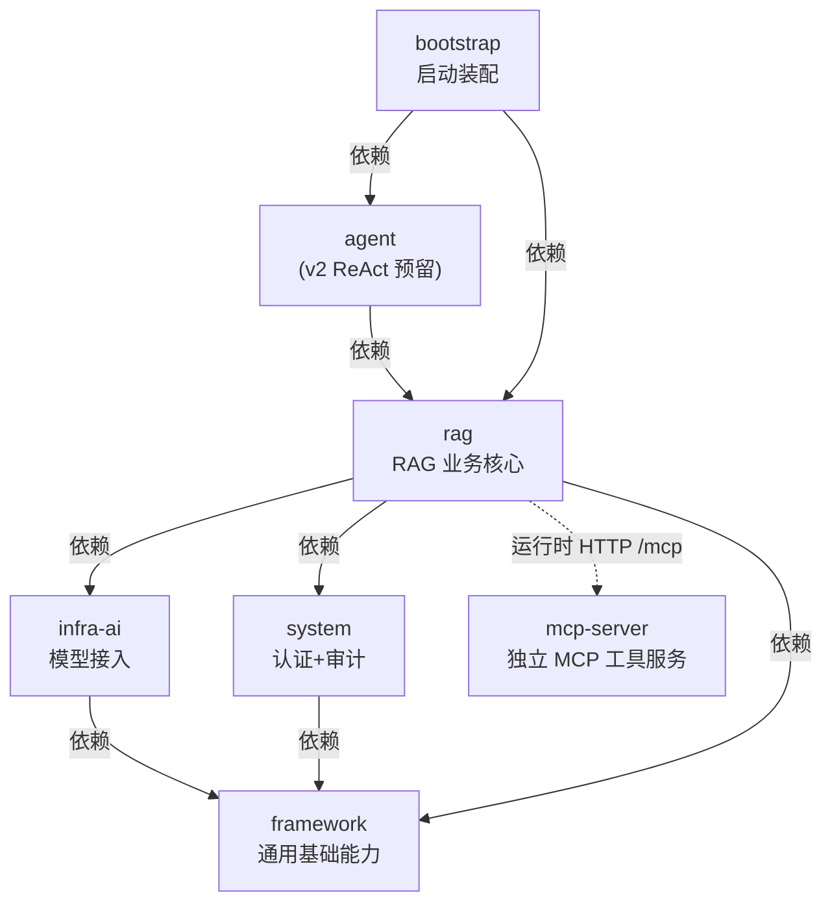

# 02 模块依赖关系与依赖链

## 1. Maven 模块概览

根 `pom.xml` 声明 7 个模块：

```xml
<modules>
    <module>framework</module>
    <module>infra-ai</module>
    <module>system</module>
    <module>rag</module>
    <module>agent</module>
    <module>bootstrap</module>
    <module>mcp-server</module>
</modules>
```

## 2. 模块依赖矩阵

依据各模块 `pom.xml` 中的 `<dependencies>`（仅统计项目内依赖）：

| 模块 | framework | infra-ai | system | rag | agent | bootstrap | mcp-server |
|:---|---:|:---:|:---:|:---:|:---:|:---:|:---:|
| framework | — | ✕ | ✕ | ✕ | ✕ | ✕ | ✕ |
| infra-ai | ✔ | — | ✕ | ✕ | ✕ | ✕ | ✕ |
| system | ✔ | ✕ | — | ✕ | ✕ | ✕ | ✕ |
| rag | ✔ | ✔ | ✔ | — | ✕ | ✕ | ✕ |
| agent | ✔(传递) | ✔(传递) | ✔(传递) | ✔ | — | ✕ | ✕ |
| bootstrap | ✔(传递) | ✔(传递) | ✔(传递) | ✔ | ✔ | — | ✕ |
| mcp-server | ✕ | ✕ | ✕ | ✕ | ✕ | ✕ | — |

说明：

- `framework` 是唯一**零项目内依赖**的底层模块，只依赖第三方库；
- `agent` 只依赖 `rag`（通过 rag 传递获得 framework/system/infra-ai），
  按设计它"仅通过窄接口消费 rag 的检索门户与人员解析"；
- `bootstrap` 依赖 `rag` 与 `agent`，是唯一包含可执行主类的装配层；
- `mcp-server` 完全独立，不依赖任何项目内模块，仅用 Spring Boot WebMVC + MCP SDK。

## 3. 依赖方向图（编译期）



依赖严格单向向下，没有循环依赖：`framework ← infra-ai/system ← rag ← agent ← bootstrap`。

## 4. 详细依赖链

### 4.1 编译 / 打包依赖链

```text
bootstrap
  └─ agent
       └─ rag
            ├─ framework
            ├─ infra-ai
            │    └─ framework
            └─ system
                 └─ framework
  └─ rag（直接依赖，同上）

mcp-server（独立构建，不参与主应用 classpath）
```

因此主应用的完整 classpath 组装顺序为：
`framework → infra-ai / system → rag → agent → bootstrap`。
构建时 Maven 会按该拓扑自动排序 reactor。

### 4.2 运行时调用依赖链（代码层面）

#### 聊天链路（rag → infra-ai → framework）

```text
RAGChatController
  → RAGChatServiceImpl
      → ChatQueueLimiter / FairDistributedRateLimiter      [rag.service.ratelimit]
      → StreamChatTraceRunner                              [rag.trace]
      → StreamChatPipeline                                 [rag.service.pipeline]
          → ConversationMemoryService                      [rag.core.memory → framework.convention.ChatMessage]
          → QueryRewriteService / QueryTermMappingService  [rag.core.rewrite]
          → IntentResolver → DefaultIntentClassifier       [rag.core.intent → infra.chat.LLMService]
          → RetrievalEngine → MultiChannelRetrievalEngine  [rag.core.retrieval]
          │     ├─ VectorSearchChannel → VectorRetrieverService [rag.core.vector]
          │     ├─ KeywordSearchChannel → EsKeywordRetrieverService [rag.core.keyword]
          │     ├─ GraphSearchChannel → GraphQueryService → LightRagClient [rag.core.graph]
          │     ├─ WebSearchChannel [rag.core.retrieval.channel]
          │     └─ Deduplication/Fusion/Rerank/Metadata 后处理器 [rag.core.retrieval.postprocessor]
          │           └─ RerankService → RoutingRerankService [infra.rerank]
          ├─ McpToolRegistry → McpClientToolExecutor      [rag.core.mcp]
          │     └─ LLMMcpParameterExtractor → LLMService  [infra.chat]
          ├─ RAGPromptService / AgentPromptResolver       [rag.core.prompt → infra.chat]
          └─ LLMService.streamChat → RoutingLLMService    [infra.chat]
                ├─ ModelSelector（Tier）→ ModelRoutingExecutor [infra.model]
                ├─ ModelHealthStore（熔断）                [infra.model]
                ├─ LlmFirstPacketProbe（首包探测）         [infra.chat]
                └─ ChatClient（BaiLian/Ollama/SiliconFlow/AIHubMix）→ OkHttp
                    └─ StreamCallback → SseEmitterSender   [framework.web]
```

#### 入库链路（rag 内部：knowledge → core/ingest → core/vector → framework.mq）

```text
KnowledgeDocumentController.upload / startChunk
  → KnowledgeDocumentServiceImpl
      → FileStorageService → ObjectStorageClient(S3/OSS)   [rag.core.storage]
      → ParserRegistry（MIME 校验）                        [rag.core.parser.registry]
      → MessageQueueProducer.sendInTransaction             [framework.mq.producer]
           └─ Kafka Outbox（t_mq_outbox → topic: knowledge-document-chunk_topic...）
  → KnowledgeDocumentChunkConsumer                         [knowledge.mq]
      → IngestionKernel.run（DefaultIngestionKernel）      [rag.core.ingest]
          → DocumentParser（Tika/Markdown/Excel/CSV/MinerU/Image-VLM）
          → ChunkingService → BlockAwareChunkerDispatcher  [rag.core.chunk]
          → ChunkEmbeddingService → EmbeddingService       [infra.embedding]
          → ChunkIndexWriter → VectorStoreService(Milvus)  [rag.core.vector]
            + RelationalChunkSink（t_knowledge_chunk）     [knowledge.sink]
            + KeywordSyncingVectorStoreService（可选 ES）  [rag.core.vector.decorator]
            + GraphSyncingVectorStoreService（可选 LightRAG）[rag.core.vector.decorator]
      → KnowledgeDocumentChunkLog（四阶段日志）             [knowledge.dao]
```

#### 认证链路（system → framework）

```text
AuthController.login
  → AuthServiceImpl → Sa-Token（StpUtil.login，Redis 会话）
  → SaInterceptor（登录校验，跳过 /auth/** 与 /error）
  → UserContextInterceptor
      → UserMapper.selectById
      → UserContext.set(LoginUser)   [framework.context, TTL 传递]
      → 业务代码 UserContext.getUserId() 使用
```

#### MCP 工具调用链路（rag → mcp-server，运行时 HTTP）

```text
rag: McpClientAutoConfiguration（启动时）
  → HttpClientStreamableHttpTransport（POST {server}/mcp）
  → McpSyncClient.listTools()
  → McpToolRegistry.register(McpClientToolExecutor)

检索时:
RetrievalEngine.executeMcpTools
  → McpToolRegistry.getExecutor(toolId)
  → LLMMcpParameterExtractor.extractParameters（LLM 提参）
  → McpClientToolExecutor.execute → MCP Server CallTool

mcp-server: McpServerConfig
  → HttpServletStreamableServerTransportProvider（/mcp）
  → McpSyncServer（serverInfo=ragent-mcp-server）
  → WeatherMcpExecutor / TicketMcpExecutor / SalesMcpExecutor / YouComSearchMcpExecutor
    （每个 Executor 注册一个 SyncToolSpecification Bean）
```

## 5. 依赖的"三个维度"总结

### 编译期依赖（Maven 声明）

```text
framework:  无项目内依赖
infra-ai:   framework
system:     framework
rag:        framework + infra-ai + system
agent:      rag
bootstrap:  rag + agent
mcp-server: 无项目内依赖
```

### 运行时数据依赖（外部中间件）

| 模块 | MySQL | Redis | Kafka | S3/OSS | Milvus | ES | LightRAG | MinerU | 模型 API |
|:---|:---:|:---:|:---:|:---:|:---:|:---:|:---:|:---:|:---:|
| framework | ✔(MyBatis) | ✔ | ✔ | ✕ | ✕ | ✕ | ✕ | ✕ | ✕ |
| system | ✔ | ✔(Sa-Token) | ✕ | ✕ | ✕ | ✕ | ✕ | ✕ | ✕ |
| infra-ai | ✕ | ✔(熔断状态) | ✕ | ✕ | ✕ | ✕ | ✕ | ✕ | ✔ |
| rag | ✔ | ✔ | ✔ | ✔ | ✔ | 可选 | 可选 | 可选 | ✔(经 infra-ai) |
| mcp-server | ✕ | ✕ | ✕ | ✕ | ✕ | ✕ | ✕ | ✕ | ✔(You.com/天气等) |

### 测试期依赖

- `rag` 的测试资源引用了 `bootstrap` 的 `application.yaml`
  （`${project.basedir}/../bootstrap/src/main/resources/application.yaml`），
  使 `@SpringBootTest` 只有单一配置来源；
- 根 pom 通过 surefire 注入 `-javaagent:mockito-core` 支持 inline mock；
- 测试覆盖重点：检索引擎、后处理器、意图分类、Prompt 服务、入库引擎、
  限流器、模型路由熔断、LightRagClient（mockwebserver3）等，共 46 个测试类。

## 6. 依赖设计要点与潜在风险

1. **分层单向、清晰**：没有循环依赖，编译期即能保证"上层可依赖下层、下层不可感知上层"。
2. **agent 模块悬空**：`agent/pom.xml` 已引入 AgentScope，但没有 `src`；
   一旦 v2 ReAct 落地，它将成为唯一消费 rag 检索门户的上层模块，注意不要把
   业务逻辑写进 agent 之外的模块造成反向依赖。
3. **rag 模块过大（460 个 Java 文件）**：内部已按子域分包（rag/core、ingestion、
   knowledge、admin、eval），但作为一个 Maven 模块仍偏重；若继续膨胀，可考虑
   把 ingestion/knowledge 拆成独立模块（它们已经与 rag/core 边界清晰）。
4. **mcp-server 与主应用同仓库但独立发布**：协议耦合（MCP）而非代码耦合，
   版本需要协同发布；`rag.mcp.servers` 为静态配置，无服务发现与重连。
5. **模型层反向屏蔽**：rag 只依赖 `infra-ai` 的抽象接口（LLMService /
   EmbeddingService / RerankService / VlmService），换供应商无需改业务代码。
