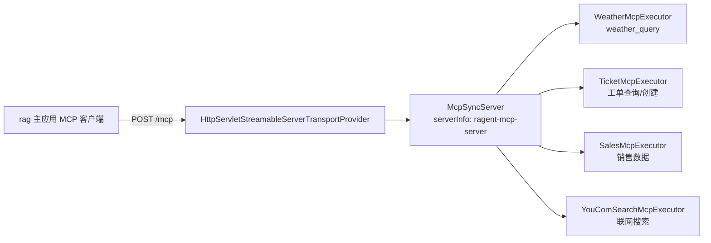

# 03 后端模块详解

本文逐一说明 `framework`、`infra-ai`、`system`、`bootstrap`、`mcp-server`、
`agent` 六个模块的设计与实现；`rag` 模块因体量最大单独放在
[04-RAG核心链路与关键机制详解.md](./04-RAG核心链路与关键机制详解.md)。

---

## 1. framework —— 通用基础能力层（42 个 Java 文件）

### 职责

统一响应与异常、认证上下文、幂等、分布式 ID、MQ 适配、Trace 支撑、SSE 与
跨节点流式取消等与业务无关的横切能力。**该模块零项目内依赖**，是全局基石。

### 1.1 包结构与关键类

| 包 | 关键类 | 说明 |
|:---|:---|:---|
| `convention` | `Result<T>`、`Results`、`ChatMessage`、`ChatRequest`、`RetrievedChunk`、`RetrievedChunkKey`、`SourceRef`、`GroundingChunk` | 跨模块共享的"约定对象"：统一响应包装、聊天消息/请求模型、检索块与来源引用 |
| `errorcode` / `exception` | `IErrorCode`、`BaseErrorCode`、`AbstractException`、`ClientException`、`ServiceException`、`RemoteException` | 三级异常体系：客户端错误 / 服务端错误 / 远程调用错误，携带错误码 |
| `web` | `GlobalExceptionHandler`、`Results`、`SseEmitterSender`、`StreamTaskManager` | 全局异常转统一响应；SSE 事件发送封装；流式任务跨节点取消 |
| `context` | `ApplicationContextHolder`、`LoginUser`、`UserContext` | Spring 容器静态持有；用户上下文基于 `TransmittableThreadLocal`（TTL），可跨异步线程传递 |
| `idempotent` | `IdempotentSubmit`、`IdempotentConsume`、对应 Aspect、`SpELUtil` | 防重复提交（Redisson 分布式锁 + SpEL key / 参数 MD5）与幂等消费 |
| `distributedid` | `CustomIdentifierGenerator`、`SnowflakeIdInitializer` | MyBatis-Plus 主键生成（雪花 ID） |
| `mq` | `MessageWrapper`、`MessageQueueProducer`、`KafkaMessageQueueProducer`、`KafkaOutboxRelay` | Kafka 发送适配与 Outbox 事务消息封装 |
| `cache` | `RedisKeySerializer` | Redis Key 序列化统一 |
| `database` | `JsonbTypeHandler`、`MyMetaObjectHandler` | MySQL JSON 类型处理；`createTime/updateTime` 等公共字段自动填充 |
| `config` | `DataBaseConfiguration`、`KafkaMessageQueueConfiguration`、`WebAutoConfiguration` | MyBatis-Plus 分页插件（MySQL 方言）、Kafka 装配、Web MVC 装配 |
| `trace` | `RagTraceNode`、`RagTraceContext`、`RagStreamTraceSupport` | 跨模块 Trace 支撑：注解 + 上下文 + 流式 Trace 回调接口 |

### 1.2 关键设计

#### 统一响应 `Result<T>`

所有接口返回 `Result<T>` 或 SSE 流；`GlobalExceptionHandler` 将
`ClientException/ServiceException/RemoteException` 转成 `code + message` 的
标准错误体，前端 axios 拦截器统一按 `code === "0"` 判断成功。

#### 用户上下文 `UserContext`（TTL）

```java
private static final TransmittableThreadLocal<LoginUser> CONTEXT = new TransmittableThreadLocal<>();
```

由 `system` 模块的 `UserContextInterceptor` 写入；异步线程池执行任务时用
`TtlRunnable.get(...)` 包装，保证检索、限流回调等异步链路仍能拿到用户身份。

#### 幂等 `IdempotentSubmit`

- 注解上可用 SpEL 指定 key（如 `UserContext.getUserId()`）；
- 未指定时以 `servletPath + userId + 参数 Gson 序列化 MD5` 为锁 key；
- Redisson `RLock.tryLock()` 失败直接抛 `ClientException`（如
  "当前会话处理中，请稍后再发起新的对话"）；
- `ragent.eval.enabled=true` 时跳过幂等，便于压测/评测。

#### 事务消息 `MessageQueueProducer`

`sendInTransaction(topic, key, bizName, message, localTransaction)` 采用
Kafka **Outbox 模式**：同一本地事务内执行业务并写入 `t_mq_outbox`，提交后由
`KafkaOutboxRelay` 投递到 Kafka，失败由定时任务补偿重试（at-least-once + 幂等消费）。
文档分块（`startChunk`）、知识库清理（`delete`）均使用该机制。

#### 流式任务跨节点取消 `StreamTaskManager`

- 本地 Guava Cache 维护 `taskId → (cancelAction, finalizer)`；
- 取消时先写 Redis 标记（30 分钟 TTL）再发 `RTopic("ragent:stream:cancel")`；
- 所有节点收到广播后 CAS 置位并依次执行 `cancelAction`（中断上游 LLM 流）与
  `finalizer`（补发 cancel 事件并结束 SSE）；
- 新注册的任务若发现 Redis 已有取消标记则立即执行取消，避免竞态。

---

## 2. infra-ai —— 模型接入层（50 个 Java 文件）

### 职责

把 Chat / Embedding / Rerank / VLM 四类模型能力抽象为统一接口，提供多供应商
实现、Tier 档位路由、健康熔断与流式首包探测回退，并负责 Token 估算。

### 2.1 能力接口与实现矩阵

| 能力 | 接口 | 路由实现 | 供应商实现 |
|:---|:---|:---|:---|
| Chat | `ChatClient` | `RoutingLLMService`（实现 `LLMService`） | `BaiLianChatClient`、`OllamaChatClient`、`SiliconFlowChatClient`、`AIHubMixChatClient` |
| Embedding | `EmbeddingClient` | `RoutingEmbeddingService`（实现 `EmbeddingService`） | `OllamaEmbeddingClient`、`SiliconFlowEmbeddingClient`、`AIHubMixEmbeddingClient` |
| Rerank | `RerankClient` | `RoutingRerankService`（实现 `RerankService`） | `BaiLianRerankClient`、`NoopRerankClient` |
| VLM | `VlmService` | `RoutingVlmService` | 复用 Chat 客户端（qwen-vl-max，经百炼） |

### 2.2 关键设计

#### 配置驱动（`AIModelProperties` + `ai.providers` / `ai.chat` / `ai.embedding` 等）

```yaml
ai:
  providers:
    bailian: { url, api-key, endpoints: { chat, rerank } }
    ollama:  { url, endpoints: { chat, embedding } }
  chat:
    candidates: [ qwen-plus, qwen-flash, qwen3-local, qwen3-max, glm-4.7, gpt-5.4 ]
    tiers:
      fast:     [ qwen-flash, qwen-plus, qwen3-local ]   # timeout 5s
      standard: [ qwen3-max, qwen-plus, qwen3-local, gpt-5.4 ]  # timeout 30s
      deep:     [ qwen3-max, glm-4.7 ]                    # timeout 120s
    default-tier: standard
    deep-thinking-tier: deep
```

#### 路由与降级（`ModelSelector` + `ModelRoutingExecutor` + `ModelHealthStore`）

- `ModelSelector.selectChatCandidates(thinking, tier, preferredModelId)`：
  按档位展开候选列表，`thinking=true` 时优先 `deep` 档；
- `ModelHealthStore`：每个候选维护健康状态，支持**熔断（open）→ 半开（half-open）
  探测 → 恢复（closed）**；`allowCall()` 返回调用许可（permit）；
- `ModelRoutingExecutor.executeWithFallback`：顺序尝试候选，成功 `markSuccess`，
  失败 `markFailure` 并切下一个；全部失败抛 `RemoteException`；
- 流式场景由 `RoutingLLMService.streamChat` + `LlmFirstPacketProbe` +
  `ProbeStreamBridge` 实现**首包超时探测**：首个 token 未在 `timeoutMs` 内到达即
  cancel 并切换下一候选，避免"假连接"。

#### OpenAI 风格协议（`AbstractOpenAIStyleChatClient`）

各供应商实现复用同一套 OpenAI 兼容 SSE 解析（`OpenAIStyleSseParser`）、错误
分类（`ModelClientErrorType`）与 URL 拼接（`ModelUrlResolver`），差异仅剩
base-url / api-key / endpoint 与供应商特有行为。

#### Token 估算（`HeuristicTokenCounterService`）

基于启发式（字符/字节换算）估算 Token，用于记忆裁剪与成本控制，不依赖供应商
精确计数接口。

#### 其他

- `LLMResponseCleaner`：清洗模型输出（去 markdown 代码围栏等）；
- `LogSafe`：日志脱敏/截断，防止泄露 prompt 或密钥；
- `StreamCallback` / `StreamCancellationHandles` / `StreamAsyncExecutor`：
  流式回调契约与异步取消支撑。

---

## 3. system —— 系统支撑层（32 个 Java 文件）

### 职责

用户认证（Sa-Token）与业务审计（bizlog），位于各业务引擎之下，供 rag 复用。

### 3.1 用户域（`user`）

| 类 | 职责 |
|:---|:---|
| `AuthController` / `AuthServiceImpl` | `POST /auth/login`（校验用户名密码 → `StpUtil.login` → 返回 token）、`POST /auth/logout` |
| `UserController` / `UserServiceImpl` | `GET /user/me`、用户 CRUD（`/users`）、改密 |
| `SaTokenConfig` | 注册 `SaInterceptor`（全路径登录校验，排除 `/auth/**`、`/error`）与 `UserContextInterceptor`；拦截器顺序：登录(0) → 演示只读(10) → 用户上下文(20) |
| `UserContextInterceptor` | 从 Sa-Token 取 loginId → 查 `t_user` → 组装 `LoginUser` 写入 `UserContext`；跳过 ASYNC dispatch 与 OPTIONS |
| `SaTokenStpInterfaceImpl` | Sa-Token 接口实现（Redis 模板存取） |
| `UserDO` / `UserMapper` / `UserRole` | 用户表映射与角色枚举（admin/user） |

### 3.2 审计域（`audit`）

基于 bizlog-sdk（`@LogRecord` 注解）实现业务变更审计：

| 类 | 职责 |
|:---|:---|
| `BizChangeLogController` | `GET /biz-change-logs` 分页查询、`GET /biz-change-logs/{id}` 详情 |
| `BizChangeLogService` / `Impl` | 日志查询 |
| `BizChangeLogRecordService` | bizlog 的 `ILogRecordService` 实现：落库 `t_biz_change_log` |
| `BizChangeLogContext` | 提供 SpEL 表达式常量（快照、操作人、请求上下文） |
| `RagentOperatorGetService` | bizlog 操作人解析（从 `UserContext` 取） |
| `BizChangeLogDO` / `Mapper` | 变更前后快照（before/after JSON）、字段差异、操作者、IP、User-Agent |

知识库文档上传、文档分块、知识库/文档修改等关键管理操作均通过
`@LogRecord` 记录了前后快照（见 04 文档的知识库部分）。

---

## 4. bootstrap —— 启动装配层（1 个 Java 文件 + 配置）

### `RagentApplication`

```java
@SpringBootApplication
@EnableScheduling
@EnableLogRecord(tenant = "ragent", proxyTargetClass = true)
@MapperScan(basePackages = {
    "com.nageoffer.ai.ragent.rag.dao.mapper",
    "com.nageoffer.ai.ragent.ingestion.dao.mapper",
    "com.nageoffer.ai.ragent.knowledge.dao.mapper",
    "com.nageoffer.ai.ragent.user.dao.mapper",
    "com.nageoffer.ai.ragent.audit.dao.mapper"
})
```

职责被刻意收窄为"启动类 + 主配置"，业务代码禁止进入本模块。

### `application.yaml`（290 行）要点

| 配置段 | 关键项 |
|:---|:---|
| `server` | 端口 9090，context-path `/api/ragent`，multipart 50MB/100MB |
| `spring.datasource` | MySQL 8.0（HikariCP，最大 10 连接，库 `ragent`） |
| `spring.data.redis` | 127.0.0.1:6379 |
| `spring.kafka` | bootstrap-servers、String 序列化器、消费组 |
| `ragent.engine` | `type: workflow`（可选 `agent`）；`demo-mode`、`eval.enabled` |
| `agent` | v2 ReAct 参数（provider=qwen3-max、max-iters=10、max-retries=2、sse-timeout） |
| `rag.*` | 存储(S3/OSS)、向量(Milvus)、关键词(ES)、图谱(LightRAG)、检索预算/通道/融合、限流、记忆、MCP servers、Trace、图片解析 prompt |
| `ai.*` | providers / chat tiers / embedding / rerank / vlm 候选与默认模型 |
| `mineru` | SaaS API 配置与并发信号量 |
| `sa-token` | token 名 Authorization、30 天过期 |
| `milvus` | uri |

配置校验是"启动期 fail-closed"的：`RetrievalConfigEnvironmentPostProcessor` +
`RetrievalConfigFailureAnalyzer` 会在启动时校验召回预算（`recall-budget ≥
default-top-k`、`rerank-candidate-limit ≥ default-top-k`）、Tier 引用与候选模型
是否存在，配置错误直接启动失败。

---

## 5. mcp-server —— 独立 MCP 工具服务（6 个 Java 文件）

### 职责

基于 MCP Java SDK 的独立 Spring Boot 应用，通过 **Streamable HTTP Transport**
在 `/mcp` 暴露工具，供主应用（rag 的 MCP 客户端）发现与调用。

### 实现



- `McpServerConfig`：注册 transport provider servlet（路径 `/mcp`）并装配
  `McpSyncServer`，自动收集所有 `SyncToolSpecification` Bean；
- 每个 Executor 是一个 `@Component`，通过 `@Bean SyncToolSpecification`
  声明工具（名称、描述、JSON Schema 参数定义）与处理函数；
- 示例工具：`weather_query`（城市天气，内置城市坐标表 + 随机天气数据，纯演示）、
  工单、销售、You.com 搜索（真实 HTTP 调用，测试含 LiveTest）；
- 与主应用解耦：`mcp-server` 不依赖任何项目内模块，可独立构建部署、独立扩展工具。

---

## 6. agent —— Agent 执行架构（v2 ReAct，预留）

### 现状

`agent/` 目录只有 `pom.xml`（31 行），**没有任何 Java 源码**。根 pom 已引入：

```xml
io.agentscope:agentscope-core
io.agentscope:agentscope-extensions-model-openai
```

### 设计意图（来自代码注释与配置）

- `ragent.engine.type: workflow` 为当前默认（v1 编排流水线）；可选 `agent` 时，
  RAG 管线将"降级为 Agent 的一个 Tool"；
- `agent` 配置段：`provider: bailian`（引用 `ai.providers`）、`model: qwen3-max`、
  `max-iters: 10`（ReAct 循环上限，超出熔断收尾）、`max-retries: 2`、
  `sse-timeout-ms: 300000`；
- pom 注释明确：**AgentScope 自带 MCP SDK 0.17.0 会被根 pom 的 1.1.2 统一压制，
  因此 agent 模块不得使用 `io.agentscope.core.tool.mcp.*` 客户端**，MCP 调用走
  rag 既有连接桥；
- 依赖设计上 agent 只依赖 `rag`，通过窄接口消费检索门户与人员解析。

> 结论：v2 ReAct 的"壳"（模块、依赖、配置、接口约束）已经就位，引擎实现待落地。
