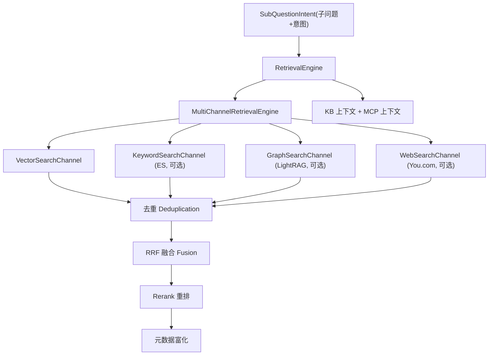

# 04 RAG 核心链路与关键机制详解

`rag` 是项目最大的模块（460 个 Java 文件），承载问答编排、混合检索、入库内核、
知识库管理、意图路由、会话记忆、限流、Trace、评估与管理后台。本章按子域展开。

## 0. 子域地图

```text
rag/src/main/java/com/nageoffer/ai/ragent/
├── admin/        管理后台（Dashboard 统计）
├── core/         核心内核
│   ├── ingest/      入库内核（固定五段）
│   ├── parser/      文档解析（Tika/Markdown/Excel/CSV/MinerU/VLM 图像）
│   ├── chunk/       分块（Block-Aware 多策略）
│   ├── intent/      意图树 + LLM 意图分类
│   ├── rewrite/     问题重写/拆分/查询词映射
│   ├── guidance/    歧义澄清
│   ├── retrieval/   多通道检索 + 后处理链
│   ├── mcp/         MCP 客户端与工具注册
│   ├── memory/      会话记忆与摘要
│   ├── prompt/      Prompt 规划与模板渲染
│   ├── source/      来源/引用/Grounding 组装
│   ├── vector/      向量存储/检索（Milvus）+ 装饰器
│   ├── keyword/     关键词索引/检索（ES）
│   ├── graph/       图谱检索（LightRAG）
│   └── storage/     对象存储（S3/OSS）
├── ingestion/    可编排入库流水线（节点链 + 任务）
├── knowledge/    知识库/文档/分块管理 + 调度 + MQ 消费
├── rag/          问答服务、流水线、限流、会话、Trace、评估、配置
└── ...（config/controller/dao/dto/enums/mq/service/trace/util/eval）
```

---

## 1. 聊天流水线（v1 Workflow）

### 1.1 入口：`RAGChatController`

```text
GET  /rag/v3/chat?question=&conversationId=&deepThinking=   → text/event-stream
POST /rag/v3/stop?taskId=                                    → 取消
```

- `chat` 标注 `@IdempotentSubmit(key = "UserContext.getUserId()")`，同一用户
  重复提交会被分布式锁拦截；
- 每次请求生成雪花 `taskId`，`SseEmitter` 超时取 `rag.default.sse-timeout-ms`（默认 5 分钟）。

### 1.2 编排：`StreamChatPipeline`

```java
public void execute(StreamChatContext ctx) {
    loadMemory(ctx);        // 1. 加载记忆（摘要+最近 N 轮并行加载）
    rewriteQuery(ctx);      // 2. 问题重写/拆分（含查询词映射）
    resolveIntents(ctx);    // 3. 子问题意图识别（LLM 打分）
    if (handleGuidance(ctx)) return;    // 4. 歧义澄清：直接提示并结束
    if (handleSystemOnly(ctx)) return;  // 5. 纯系统意图：仅 LLM 对话
    RetrievalContext retrievalCtx = retrieve(ctx);   // 6. 检索（KB + MCP）
    if (handleEmptyRetrieval(ctx, retrievalCtx)) return;  // 7. 无结果兜底
    streamRagResponse(ctx, retrievalCtx);   // 8. 组装来源 + Prompt + 流式生成
}
```

### 1.3 流式回调与 SSE 事件契约

`StreamCallbackFactory.createChatEventHandler` 生成事件处理器，统一输出
SSE 事件（`SSEEventType` 枚举）：

| 事件 | 载荷 | 说明 |
|:---|:---|:---|
| `meta` | `MetaPayload(conversationId, taskId)` | 会话/任务标识 |
| `sources` | `List<SourceRef>` | 唯一来源编号（docId、chunkId、collection、标题、页码、链接） |
| `grounding` | `List<GroundingChunk>` | grounding 片段（不参与 prompt，供追问生成） |
| `message` | `MessageDelta(type: response/think, content)` | 增量内容；`think` 类型前端单独渲染思考过程 |
| `finish` | `CompletionPayload(messageId, title, ...)` | 完成（含落库消息 ID、状态） |
| `done` | `[DONE]` | 流结束 |
| `reject` | `MessageDelta` | 限流拒绝 |
| `cancel` | `CompletionPayload` | 用户取消 |
| `error` | `{error}` | 错误 |

### 1.4 服务实现：`RAGChatServiceImpl`

```java
streamChat(question, conversationId, deepThinking, emitter):
  taskId = snowflake
  callback = callbackFactory.createChatEventHandler(emitter, conversationId, taskId)
  chatQueueLimiter.enqueue(question, conversationId, emitter,
      () -> traceRunner.run(question, conversationId, taskId, callback,
          ctx -> chatPipeline.execute(ctx)))
```

聊天受全局公平限流器保护，拒绝时仍会补写"系统繁忙"消息并输出完整 SSE 生命周期。

---

## 2. 问题理解（Rewrite / Intent / Guidance）

### 2.1 重写与拆分：`QueryRewriteService` / `MultiQuestionRewriteService`

- 结合历史会话将提问补全（多轮上下文）；
- 识别多意图问题并拆分为子问题（`RewriteResult.subQuestions()`），带出去重；
- 前置查询词映射 `QueryTermMappingService`：`t_query_term_mapping` 中维护
  业务同义词（如"报销"→"费用申请"），命中后替换/补充查询词。

### 2.2 意图识别：`IntentResolver` + `DefaultIntentClassifier`

- 意图树数据从 `t_intent_node` 加载后缓存到 Redis（`IntentTreeCacheManager`），
  每次分类都先读 Redis、缺失回源 DB 并回填；
- `DefaultIntentClassifier` 将**全部叶子节点**（id / fullPath / description /
  examples / type）拼进一个 Prompt，调用 LLM 对每个分类打 0~1 分，返回
  `[{"id": "...", "score": 0.9, "reason": "..."}]`；
- `IntentResolver` 对每个子问题并行分类，过滤 `score >= INTENT_MIN_SCORE`、
  限制总意图数 `MAX_INTENT_COUNT`（每子问题保底 1 个最高分意图）；
- 意图节点类型（`IntentKind`）：`KB`（绑 1..N 个 collection）、`MCP`
  （绑 `mcpToolId` + 提参 prompt）、`SYSTEM`（纯对话，可带自定义 prompt 模板）。

### 2.3 歧义澄清：`IntentGuidanceService` + `AmbiguityLLMChecker`

命中歧义场景（如多知识库难以抉择、问题信息不足）时，先让 LLM 判断是否需要
向用户提问，需要则直接输出澄清文案并结束本轮，避免"带着猜测去检索"。

---

## 3. 检索引擎（Hybrid Retrieval）

### 3.1 三层结构



### 3.2 检索作用域（`RetrievalScopeResolver`）

依据意图树节点绑定的 collection 计算"本次检索看哪些知识库"：

- `min-intent-score: 0.4`：低于该分数的意图节点不参与收窄判定；
- `confidence-threshold: 0.6`：KB 意图最高分低于阈值 → 退化为**全库检索**；
- `supplement-ratio: 0.25`：定向命中时，各通道从自身产出额度中划出保底比例
  补给"未命中库"，兜住意图判错；
- 方向判定只看 KB 意图最高分，不看意图个数；任何通道关闭不影响其他通道。

### 3.3 多通道并行执行（`MultiChannelRetrievalEngine`）

- 按通道类型枚举序稳定排序后，在专用线程池并行执行所有启用通道；
- 每通道独立超时（`channels.timeout-ms: 15000`），超时/异常 → 空结果降级，
  **不阻塞其余通道融合**；
- 检索预算 `RetrievalBudget` 三段式：`recall-budget`（每通道召回上限）→
  `rerank-candidate-limit`（进 Rerank 的候选上限）→ `default-top-k`（最终进
  LLM 的条数）。

### 3.4 通道实现

| 通道 | 实现 | 说明 |
|:---|:---|:---|
| 向量 | `VectorSearchChannel` → `VectorRetrieverService`（Milvus） | Milvus 共享库按标量过滤；按 `CollectionParallelRetriever` 逐库并行 fan-out |
| 关键词 | `KeywordSearchChannel` → `EsKeywordRetrieverService` | `rag.keyword.type=es` 时启用；按 `collection_name` 字段区分知识库；analyzer `ik_max_word` |
| 图谱 | `GraphSearchChannel` → `GraphQueryService` → `LightRagClient` | `rag.graph.type=lightrag` 时启用；query-mode hybrid；供后台知识图谱可视化与检索 |
| 联网 | `WebSearchChannel` | You.com Search API（`YDC_API_KEY`），count 默认 5 |

### 3.5 后处理链（`SearchResultPostProcessor`，按 order 排序）

1. `DeduplicationPostProcessor`：按 `RetrievedChunkKey`（collection + docId +
   chunkId + 内容指纹）去重，保留最高分；
2. `FusionPostProcessor`：RRF（Reciprocal Rank Fusion，`rrf-k: 20`）融合各通道
   排名，并叠加 `channel-weights`（vector 1.0 / keyword 1.0 / graph 0.8 /
   web-search 0.5）；
3. `RerankPostProcessor`：调用 `RerankService`（百炼 rerank，`rerank-noop`
   兜底）重排，截断到 `rerank-candidate-limit`；
4. `MetadataEnrichmentPostProcessor`：回填文档标题、文件 URL、页码范围等展示元数据。

### 3.6 输出与归属

- 检索结果按意图聚合（`intentChunks`），并从"存活的 chunk 所属 collection"反向
  推导意图归属（`deriveAttribution`），保证 Prompt 规划时"内容来自哪个意图"
  准确对应；
- `ContextFormatter` 按 KB 意图分组渲染证据块，多子问题用
  `sub-question-kb-wrapper` 分区包裹。

---

## 4. MCP 工具集成

### 4.1 启动期

`McpClientAutoConfiguration` 遍历 `rag.mcp.servers`，为每个 Server 建立
`McpSyncClient`（Streamable HTTP Transport，URL 自动补 `/mcp`），`listTools()`
发现工具后注册到 `McpToolRegistry`（内存 Map，工具 ID → `McpClientToolExecutor`）。

### 4.2 问答期

```text
IntentClassifier 命中 MCP 类型意图
  → RetrievalEngine.executeMcpTools（并行）
      → McpParameterExtractor.extractParameters（LLM 从问题中提取工具参数）
           ├─ SUCCESS           → 调用远端工具
           ├─ NEED_CLARIFICATION → 不调用，注入结构化追问提示（isError=false）
           └─ FAILED            → 不调用，注入失败提示（isError=true）
      → ContextFormatter.formatMcpContext（结果进入 LLM 上下文）
```

缺少必填参数时工具"不执行而是让 LLM 主动向用户追问"，避免幻觉参数调用。

---

## 5. 会话记忆

### 5.1 加载（并行）

`DefaultConversationMemoryService.load` 在专用线程池**并行**加载：

- 摘要：`JdbcConversationMemorySummaryService.loadLatestSummary`
  （`t_conversation_summary`，作为 `history[0]` 的 system 消息紧贴系统提示词）；
- 历史：`JdbcConversationMemoryStore.loadHistory`（`t_message`，保留最近
  `history-keep-turns: 8` 轮，按 createTime + ID 双键排序保证顺序稳定）。

### 5.2 写入与压缩

- `append` 落库后触发 `compressIfNeeded`：超过 `summary-start-turns: 9` 轮时，
  用 LLM 把旧消息压缩成 ≤ `summary-max-chars: 400` 的持久化摘要，控制 Token 成本；
- 用户问题写入即触发 `ConversationTitleGenerator`（LLM 生成 ≤ 30 字标题）。

---

## 6. Prompt 管理

### 6.1 运行时 Prompt（Agent Profile / Prompt Slot）

- `t_agent_profile`（全局 Profile）+ `t_agent_prompt`（Slot 键值）取代静态模板，
  管理端可维护与激活；
- `AgentPromptResolver.resolve(AgentPromptSlot)`：优先当前激活 Profile 的 Slot，
  未配置回退内置默认值；`AgentPromptCacheManager` 做本地缓存；
- Slot 枚举覆盖：`SYSTEM_CHAT`、`KB_ANSWER`、`MCP_ANSWER`、`MIXED_ANSWER` 等。

### 6.2 场景化规划（`RAGPromptService`）

根据上下文判定场景：

| 场景 | 触发条件 | 模板策略 |
|:---|:---|:---|
| `KB_ONLY` | 只有 KB 证据 | 命中意图自带 prompt > 默认 KB_ANSWER |
| `MCP_ONLY` | 只有 MCP 证据 | 单意图自带 prompt > 默认 MCP_ANSWER |
| `MIXED` | 两者都有 | 默认 MIXED_ANSWER |

消息序列统一为 `system（+引用规则）→ history（含摘要）→ user（证据块 + 问题）`；
引用开启时动态拼接 `ANSWER_CITATION_RULES_PROMPT_PATH` 规则（`[N](#cite-N)`）。
`PromptTemplateLoader` 渲染 `resources/prompt` 下的 `.st` 模板（含
`context-format.st`、`intent-classifier.st` 等）。

---

## 7. 来源与引用（Source / Citation / Grounding）

- `SourcesAssembler.assemble(intentChunks)`：检索完成后建立**全链路唯一来源编号**
  （同一列表用于 sources 事件、来源面板、消息落库与行内引用角标）；
- `CitationContextEnricher.enrich`：向 KB 上下文注入编号（开关 `rag.citation.enabled`；
  关闭时仅清理内部 docId，不影响文档级来源面板）；
- `GroundingChunksAssembler`：装配 grounding 片段随消息落库，供回答后的
  "推荐追问"生成使用（不参与本次 prompt）；
- `CitationMarkup`：处理行内 `[N](#cite-N)` 引用标记。

---

## 8. 入库链路

### 8.1 固定五段内核：`IngestionKernel`

```text
① identity  字节+文件名 → MIME（全链路唯一一次，无入参可传错）
② parse     (MIME × 档位) → List<Block>
③ chunk     Block 类型 → chunker + 预算 → List<Chunk>
④ embed     向量化（校验维度）
⑤ index     ChunkSink 扇出，事务边界在此
```

`DefaultIngestionKernel` 是主实现；取数是内核之前的事，任务状态流转与摄取日志
归外层（knowledge 子域）。

### 8.2 解析器（`DocumentParser` 策略族）

| 解析器 | 适用 | 说明 |
|:---|:---|:---|
| `TikaDocumentParser` | PDF / DOC / DOCX / PPT 等 | Tika 3.2 解析为文本 + 元数据 |
| `MarkdownDocumentParser` | .md | commonmark AST 输出 `HeadingBlock/ParagraphBlock` 等结构化块 |
| `CsvDocumentParser` / `ExcelDocumentParser` | csv / xlsx | 表格归一化、超链接解析、值格式化；抽取表格/图片资产 |
| `MinerUDocumentParser` | 富文档（可选） | MinerU SaaS：上传 → 轮询（`MinerUPollingExecutor`）→ 结果解包；并发受分布式信号量 `rag:mineru:parse` 限制 |
| `ImageDocumentParser` | 图片（VLM） | 用 `VlmService`（qwen-vl-max）按 `rag.image-parse` prompt 生成自包含知识文本 |

`ParserRegistry` 按 **MIME × ParseProfile** 选择解析器，不支持的组合**明确失败**
（fail-closed），上传时前置拦截并删除已存对象。

### 8.3 分块（Block-Aware）

`ChunkingService` → `BlockAwareChunkerDispatcher` 按块类型分派：

- `HeadingChunker`（标题层级切分）、`ParagraphChunker`、`ListChunker`、
  `TableChunker`、`CodeChunker`、`ImageChunker`、`HtmlTableChunker`；
- `ChunkPacker` + `ChunkBudget` 控制块合并与预算（防过大/过小）；
- `Chunk` → `EmbeddedChunk`（含 `embedding_text`：向量化文本与展示正文解耦）。

### 8.4 可编排流水线（`ingestion` 子域，双轨的另一条）

- `IngestionPipelineDO` / `IngestionPipelineNodeDO`：管理端可配置节点链；
- `IngestionEngine`：节点链校验（环检测、单起点、引用完整性）→ 条件求值
  （`ConditionEvaluator`）→ 链式执行（`IngestionNode`）→ 输出提取与日志
  （`NodeOutputExtractor`）；
- 节点类型（`IngestionNodeType`）：`fetcher → parser → chunker → enhancer →
  enricher → indexer`；
- `EnhancerNode`/`EnricherNode` 由 LLM 驱动（`EnhancerPromptManager`/
  `EnricherPromptManager`），用于摘要增强、元数据补全等；
- 数据源 `DocumentFetcher` 策略：`HttpUrlFetcher`（含 ETag/Last-Modified/
  SHA-256 三级变更判定）、`FeishuFetcher`（飞书文档）。

### 8.5 知识库管理（`knowledge` 子域）

#### 文档上传与分块（Kafka Outbox 事务）

```text
POST /knowledge-base/{kb-id}/docs/upload (multipart)
  → 存储对象（S3/OSS）→ MIME 校验 → 落 t_knowledge_document(PENDING)
POST /knowledge-base/docs/{doc-id}/chunk
  → sendInTransaction(chunkTopic, docId, event, localTransaction):
      localTransaction 内: 文档状态 RUNNING + 更新 schedule + 写 t_mq_outbox
  → 事务提交 → KafkaOutboxRelay 投递 → KnowledgeDocumentChunkConsumer 消费
      → executeChunk → runChunkTask
          → IngestionKernel.run(...)（Parse→Chunk→Embed→Index）
      → 状态流转 PENDING→RUNNING→COMPLETED/FAILED
      → t_knowledge_document_chunk_log 记录四阶段耗时/输出
```

事务消息保证"状态置 RUNNING"与"分块消息"最终一致；`startChunk` 的乐观锁
（`status != RUNNING` 条件更新）防止并发重复分块。

#### 落库扇出（sink）

- `RelationalChunkSink`：写入 `t_knowledge_chunk`（含 jsonb 字段，由
  `GroundingChunkListTypeHandler`/`SourceRefListTypeHandler` 等类型处理器支持）；
- `VectorStoreService.indexDocumentChunks`：Milvus 向量索引；
- 装饰器 `KeywordSyncingVectorStoreService`（可选 ES 关键词索引同步）、
  `GraphSyncingVectorStoreService`（可选 LightRAG 图谱同步）。

#### 定时刷新（`knowledge/schedule`）

`KnowledgeDocumentScheduleJob` 按 cron 扫描远程文档（HTTP/飞书），
`ScheduleLockManager` 用 Redis 分布式锁保证多实例不重复执行；变更判定走
`ScheduleRefreshProcessor`（ETag → Last-Modified → SHA-256 三级）。

### 8.6 对象存储（`ObjectStorageClient`）

- `S3ObjectStorageClient`：S3 兼容（AWS SDK，path-style，支持 RustFS/MinIO）；
- `OssObjectStorageClient`：阿里云 OSS；
- 两个 bucket：`ragent-sources`（私有，知识库文件，按 collectionName 目录隔离）
  与 `ragent-assets`（公共读，PDF 抽取图片等浏览器直连预览）。

---

## 9. 向量 / 关键词 / 图谱存储抽象

### 9.1 向量（`VectorStoreService` / `VectorRetrieverService` / `VectorStoreAdmin`）

- 写入：`indexDocumentChunks / updateChunk / deleteDocumentVectors /
  deleteChunkById / deleteChunksByIds`；
- 检索：`retrieve / retrieveByVector / embedAndNormalize /
  supportsGlobalRetrieval`；
- 实现：`MilvusVectorStoreService`（collection 管理、标量过滤，milvus-sdk-java 3.0.6）；
- 检索器：`MilvusVectorRetrieverService`；
- 启动期 `VectorSpaceInitializer` / `StorageInitializer` 自动建 collection / 桶。

### 9.2 关键词（ES）

`EsKeywordIndexService` / `EsKeywordRetrieverService`，索引 `rag_keyword_store`，
按 `collection_name` 区分知识库，analyzer `ik_max_word`。

### 9.3 图谱（LightRAG）

`LightRagClient` 封装 HTTP 调用（`base-url: http://127.0.0.1:9621`，
`query-mode: hybrid`）；`GraphQueryService` 供检索与后台可视化
（`GraphController: /admin/kg/graph、/admin/kg/labels`）；`GraphEvidence` /
`GraphFileSource` 支持以文件方式同步图谱数据。

---

## 10. 限流与并发控制

### 10.1 聊天全局限流：`FairDistributedRateLimiter`

生产级分布式公平队列，Redis 原语组合：

- **队列**：`RScoredSortedSet`（score = 自增序号，严格 FIFO）；
- **信号量**：`RPermitExpirableSemaphore`（`max-concurrent: 10`，租约
  `lease-seconds: 30`，自动过期防泄漏）；
- **原子抢占**：Lua 脚本 `lua/queue_claim_atomic.lua`（校验存活标记 + 出队 +
  返回原 score），避免并发抢占乱序；
- **通知**：`RTopic("...:queue:notify")` 广播"有空位"，进程内 `PollNotifier`
  合并通知批量唤醒 poller，避免忙轮询；
- **状态机**：每个请求一个 Ticket，`PENDING → GRANTED / TIMED_OUT / CANCELLED`
  CAS 单终态，保证回调至多一次；JVM 崩溃时 entry 标记 TTL 兜底清理；
- 超时（`max-wait-seconds: 15`）走 `handleReject`：补写"系统繁忙"消息 + 完整
  SSE 生命周期。

### 10.2 其他分布式信号量

- 文档上传：`rag:document:upload`（10 并发）；
- MinerU 解析：`rag:mineru:parse`（5 并发，900s 租约）；
- 定时刷新锁：`schedule` 专用锁。

`SemaphoreInitializer` 启动时预置许可数（`trySetPermits` 幂等）。

---

## 11. 可观测性：Trace 与评估

### 11.1 Trace（AOP 埋点）

- `RagTraceNode` 注解 + `RagTraceAspect`：拦截聊天流水线的关键阶段（问题重写、
  意图识别、检索、通道检索、LLM 路由、Prompt 构建等），记录节点类型、耗时、
  输入输出（截断 `max-error-length`）；
- 数据落 `t_rag_trace_run` / `t_rag_trace_node`；`RagTraceController` 提供
  运行列表与节点详情，管理后台 `/admin/traces` 可视化；
- 流式场景由 `StreamChatTraceRunner` 把 Trace 上下文包装进回调，事件与落库
  解耦。

### 11.2 评估（`eval`）

`EvalController: GET /rag/eval`，`EvalProperties`（`ragent.eval.enabled`）控制；
评测模式会绕过幂等与部分限流，便于批量压测与效果回归。

---

## 12. 管理后台与其余能力

### 12.1 Dashboard（`admin`）

`DashboardController: /admin/dashboard/overview|performance|trends`，输出 KPI、
性能与趋势序列（前端 Recharts 渲染）。

### 12.2 其余控制器速览

| 控制器 | 路径前缀 | 能力 |
|:---|:---|:---|
| `ConversationController` | `/conversations` | 会话列表/改名/删除/消息分页 |
| `MessageFeedbackController` | `/conversations/messages/{id}/feedback` | 点赞/点踩（MQ 异步） |
| `RecommendedQuestionController` | `/conversations/messages/{id}/recommended-questions` | 基于 grounding 生成推荐追问 |
| `IntentTreeController` | `/intent-tree` | 意图树 CRUD + 批量启停/删除 |
| `AgentProfileController` | `/agents` | Profile 与 Prompt Slot 管理 |
| `QueryTermMappingController` | `/mappings` | 查询词映射 CRUD |
| `SampleQuestionController` | `/sample-questions` | 示例问题管理 |
| `RAGSettingsController` | `/rag/settings` | 系统设置展示 |
| `IngestionPipelineController` / `IngestionTaskController` | `/ingestion/*` | 入库流水线/任务 |
| `KnowledgeBaseController` 等 | `/knowledge-base/*` | 知识库/文档/分块 |
| `GraphController` | `/admin/kg/*` | 知识图谱可视化 |

### 12.3 会话与消息落库

`ConversationServiceImpl` / `ConversationMessageServiceImpl`：消息持久化包含
正文、思考内容、来源（sources）、推荐追问上下文（recommended_questions）、
状态（SUCCESS/REJECTED/CANCELLED/ERROR）与 replyToMessageId。

---

## 13. rag 模块的工程细节

### 13.1 线程池

`ThreadPoolExecutorConfig` 定义专用池：检索通道池、意图分类池、记忆加载池、
上下文构建池、MCP 批调池、聊天入口池等，均使用 TTL 包装以传递用户上下文。

### 13.2 配置校验（fail-closed）

- `RetrievalConfigEnvironmentPostProcessor`：启动前校验检索预算与 Tier 配置；
- `RetrievalConfigFailureAnalyzer`：把启动失败映射为可读错误；
- `ChatTierConfigValidator`：校验 Tier 引用与候选模型存在性；
- `MemoryConfigValidator` / `ValidMemoryConfig`：记忆配置合法性；
- `RetrievalChannelConfigValidator`：通道开关与后端开关一致性
  （如 graph 通道开启必须 graph.type=lightrag）。

### 13.3 演示只读模式

`DemoModeInterceptor`（`ragent.demo-mode`）：体验环境拦截写操作，只读浏览。

### 13.4 MQ 消费

`MessageFeedbackConsumer` 消费 `MessageFeedbackEvent`，把点赞/点踩异步写入
`t_message_feedback`，避免反馈接口阻塞聊天主链路。

### 13.5 编码与展示

`Utf8ResponseFilter` 统一 UTF-8 响应；`DisplayType` 工具决定文件/资产的展示
方式（预览、下载、外链）。
